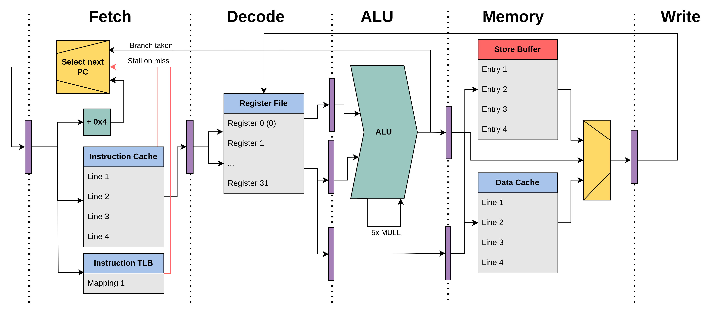

# Buena Onda Compute 🌊
**Processor Architecture Manual**  

**Authors**  
- Emmanuel Onyekachukwu Irabor  
- Jakob Eberhardt  

---

## Table of Contents
1. [Introduction](#introduction)
2. [Pipeline](#pipeline)
3. [Instructions](#instructions)
   - [Encoding](#encoding)
   - [Load](#load)
   - [Store](#store)
   - [Branch](#branch)
   - [Arithmetic](#arithmetic)
   - [Exceptions](#exceptions)
4. [Performance](#performance)
5. [Installation](#installation)


---

## Introduction
In this project, we designed and implemented a 5-stage RISC-V processor. We further enhanced the performance of our design by adding fully-fledged bypassing logic, a data and instruction cache, and a store buffer.

## Pipeline
  
*Figure 1: The 5-stage pipeline.*

## Instructions

On **reset**, all structures (iTLB, instruction cache, register file, data cache, store buffer, etc.) are initialized. The processor passes the program counter to the instruction cache. Upon boot, the stall signals of the instruction cache and the instruction TLB are high, hence the fetch stage will initially freeze the PC and insert NOPs into the pipeline until any page fault and cache miss is handled. The behavior of the instructions in the further stages is described in the following sections.

### Encoding
Below is a subset of the **RV32I Base Integer Instructions**:

| **Inst Name** | **FMT** | **Opcode** | **funct3** | **funct7** | **Description**                          |
|--------------:|:-------:|:----------:|:----------:|:----------:|:-----------------------------------------|
| `add`         | R       | 0110011    | 0x0        | 0x00       | rd = rs1 + rs2                           |
| `sub`         | R       | 0110011    | 0x0        | 0x20       | rd = rs1 - rs2                           |
| `mul`         | R       | 0110011    | 0x0        | 0x01       | rd = rs1 × rs2                           |
| `addi`        | I       | 0010011    | 0x0        | –          | rd = rs1 + imm                           |
| `lb`          | I       | 0000011    | 0x0        | –          | rd = M[rs1 + imm][0:7]                   |
| `lw`          | I       | 0000011    | 0x2        | –          | rd = M[rs1 + imm][0:31]                  |
| `sb`          | S       | 0100011    | 0x0        | –          | M[rs1 + imm][0:7] = rs2[0:7]             |
| `sw`          | S       | 0100011    | 0x2        | –          | M[rs1 + imm][0:31] = rs2[0:31]           |
| `beq`         | B       | 1100011    | 0x0        | –          | if(rs1 == rs2) PC += imm                 |
| `jalr`        | I       | 1100111    | 0x0        | –          | rd = PC + 4; PC = rs1 + imm              |

---

### Load
Every load instruction travels through the five-stage RISC-V pipeline (IF, ID, EX, MEM, WB) to retrieve data from memory. Key points:

1. **CPU Request Signals (`cpu_req`):**  
   - For load (`LW`, `LB`), `cpu_req.valid = 1` and `cpu_req.rw = 0` (read).
   - The address is computed by the ALU (`rs1 + offset`) and placed on `cpu_req.addr`.

2. **Store Buffer (SB) Forwarding:**  
   - Before going to the cache, the load checks the Store Buffer for a pending store to the same address. If found, data is forwarded from the SB (bypassing memory).

3. **Cache FSM (`dm_cache_fsm`):**  
   - On a cache hit, data is returned immediately.
   - On a miss, a request is sent to main memory, and the pipeline may stall until the data is fetched.

4. **Main Memory (`DMemory`):**  
   - Has a fixed latency (e.g., 5 cycles).
   - Once data is returned, the cache is updated, and the pipeline resumes.

5. **Final Value Assembly:**  
   - The raw 32-bit data from the cache or SB is optionally sign-extended (e.g., for `LB`) and then written back to the register file.

6. **Stalling Logic:**  
   - The pipeline stalls if the cache is busy on a miss or if the store buffer is full and needs draining.

---

### Store
Store instructions also pass through IF, ID, EX, MEM, WB, but differ in how data is committed:

1. **CPU Request Signals:**  
   - For store (`SW`, `SB`), `cpu_req.valid = 1` and `cpu_req.rw = 1` (write).  
   - `cpu_req.addr` gets `rs1 + offset`; `cpu_req.data` gets the data to store.

2. **Store Hit & Store Buffer Enqueue:**  
   - On a cache hit, the store is considered “complete” from the CPU’s perspective.  
   - The store is enqueued in the Store Buffer to be drained to the cache/memory later.

3. **Store Buffer (SB) Drain Process:**  
   - The SB holds (address, data, `wstrb`) for each store.  
   - Drains stores one at a time to the cache when idle or forced (if SB is full).

4. **Cache FSM & Dirty Lines:**  
   - Updates the cache line, marks it dirty.  
   - If eviction is needed, dirty lines are written back to main memory.

5. **Writes to Main Memory:**  
   - Actual memory writes occur on cache eviction or store misses.

6. **Stalling Conditions:**  
   - The pipeline stalls if the SB is full or the cache FSM is busy.

---

### Branch
Branches are supported by combining the IF stage (for PC updates) and the EX stage (for branch condition checks):

1. **Branch Offset Generation:**  
   - In ID, sign-extend the offset bits.

2. **Branch Condition Check:**  
   - In EX, check if `rs1 == rs2` for `BEQ` (or other conditions for different branch types).
   - If true, set `takebranch_int = 1`.

3. **Bypassing for Branch Decisions:**  
   - Uses the Bypass Unit to get the latest values for the branch comparison.

4. **PC Update in the IF Stage:**  
   - If `takebranch = 1`, `PC` is updated to `(PC - 4) + branch_offset` or for `JALR`, `PC = rs1 + imm_i`.

5. **Pipeline Flush & Control Signals:**  
   - When a branch is taken, one or more instructions in the pipeline are flushed and replaced with NOPs.

---

### Arithmetic
Arithmetic instructions (e.g., `ADD`, `SUB`, `MUL`) typically have one destination register and two source registers:

1. **Instruction Types:**  
   - `ALUopI`: one register + immediate (e.g., `ADDI`).  
   - `ALUopR`: two registers (e.g., `ADD`, `SUB`, `MUL`).

2. **ALU Logic:**  
   - Single-cycle add/sub.  
   - Multi-cycle for `MUL` if needed, with stalls in EX until multiplication completes.

3. **Immediate Generation & ALU Input Selection:**  
   - S-type, I-type, B-type instructions sign-extend the immediate.  
   - Choose between register data or immediate in the EX stage.

4. **Pipeline Integration:**  
   - ID: decode operands.  
   - EX: perform the operation in the ALU.  
   - Results pass to MEM, then WB.

---

### Exceptions
Exceptions are detected primarily in a Hazard Unit and propagated through the pipeline:

1. **Unaligned Memory Access:**  
   - For `LW`/`SW` (word-aligned) when address `alu_result[1:0] != 0`.

2. **Divide-by-Zero:**  
   - For a `DIV` instruction if the divisor (`rs2`) is zero.

3. **No Exception Default:**  
   - Otherwise, `excpt_out = NO_EXCEPTION`.

**Exception Propagation and Handling**  
- **HazardUnit to Pipeline:**  
  - `excpt_out` is sent down the pipeline, along with the faulting PC.  
- **PC Redirection in IF:**  
  - If `excpt_in` is non-zero, `PC` is loaded with an exception handler address (`EXCPT_ADDR`).  
- **Pipeline Register Flush:**  
  - Stages get flushed by inserting NOPs, and control is transferred to the exception handler.

---

## Performance
- The instruction cache can hold up to sixteen instructions (FIFO replacement).  
- The store buffer drains pending stores during stalls (e.g., on a cache miss).  
- On an instruction cache miss, the pipeline inserts five NOPs, during which stores may drain.  
- Virtual instruction memory helps reduce fragmentation.

---


## Installation
```bash
sudo apt-get install gtkwave iverilog
```

## ISA Reference
https://dmytrish.net/lib/riscv/index.html

## Instruction Decoder
https://luplab.gitlab.io/rvcodecjs/

## Installing Modelsim

```bash
sudo dpkg --add-architecture i386
sudo apt-get update
sudo apt-get install libc6:i386 libncurses5:i386 libstdc++6:i386 lib32ncurses6 libxft2 libxft2:i386 libxext6 libxext6:i386
```

Download the ModelSim - Intel FPGA edition installer (both packages) from the Intel homepage.(https://download.altera.com/akdlm/software/acdsinst/20.1std.1/720/ib_installers/ModelSimSetup-20.1.1.720-linux.run)

### Make the installer executable and run it: 
```bash 
chmod +x ModelSimSetup-20.1.1.720-linux.run
./ModelSimSetup-20.1.1.720-linux.run
```

### Export the path: can add to .bashrc
```bash
export PATH=$PATH:/path_to_model_sim/modelsim_ase/bin
```

### Build and run the project
```bash
make
```